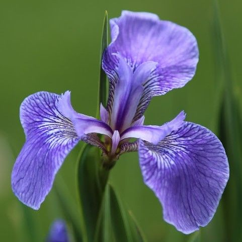

<h1 align="center">
Iris Flower Classification
</h1>

 

<h3 align="center">
  The Iris flower classification using octave (currently implementing) and tensorflow.js.
</h3>

# *The Iris flower classification*

is a classic Machine Learning problem.
I decided to use this problem as a way to apply what I have learnt.
I am currently following the Coursera Machine Learning Material by Andrew Ng from Stanford University.
The course is incredibly compelling, however I am also interested in experimenting with more recent technologies and executing alternative application methods.

Tensorflow.js: Building the Neural Network using compact javascript code.

cd `./tensorflowJs/`,

run `node ./generateTest.js` to generate the training set, then `node ./index.js` to run the application.

Octave: Equation based implementation of logistic regression, using the following article as reference:

`https://medium.com/@pranav_suresh/iris-classification-using-logistic-regression-using-octave-873bca96ec5b`
